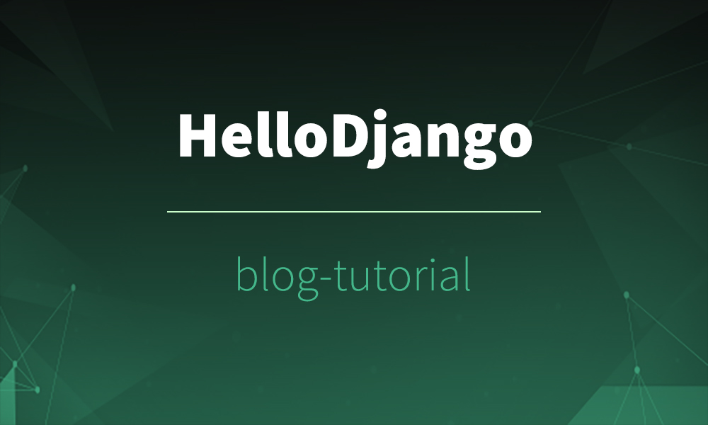

# DjangoLearning 

---

**李菜鸟的坎坷开发之路**  
  
本仓库来源于 👉 💻 [Hello-Django-Blog-Tutorial](https://github.com/HelloGitHub-Team/HelloDjango-blog-tutorial)   

[//]: # (  )

[//]: # (
)

[//]: # (  )

[//]: # (   <strong>HelloDjango-blog-tutorial</strong> )

[//]: # (  <strong>完全免费、开源的 HelloDjango 系列教程之博客开发</strong>。 )

[//]: # (  基于 django 2.2，带你从零开始一步步创建属于自己的博客网站。)

[//]: # (
)

---  

## 原教程仓库资源列表
- [成品在线预览](https://hellodjango-blog-tutorial-demo.zmrenwu.com/)
- 教程首发 HelloGitHub 微信公众号和 [追梦人物的博客](https://www.zmrenwu.com/)，在线学习地址：[HelloDjango - Django博客教程（第二版）](https://zmrenwu.com/courses/hellodjango-blog-tutorial/)
- 项目 [源码仓库](https://github.com/HelloGitHub-Team/HelloDjango-blog-tutorial)
- 项目 [前端模板源码仓库](https://github.com/zmrenwu/django-blog-tutorial-templates)

## Records  

* 0420: 开始整个项目并开始着手写文档。

